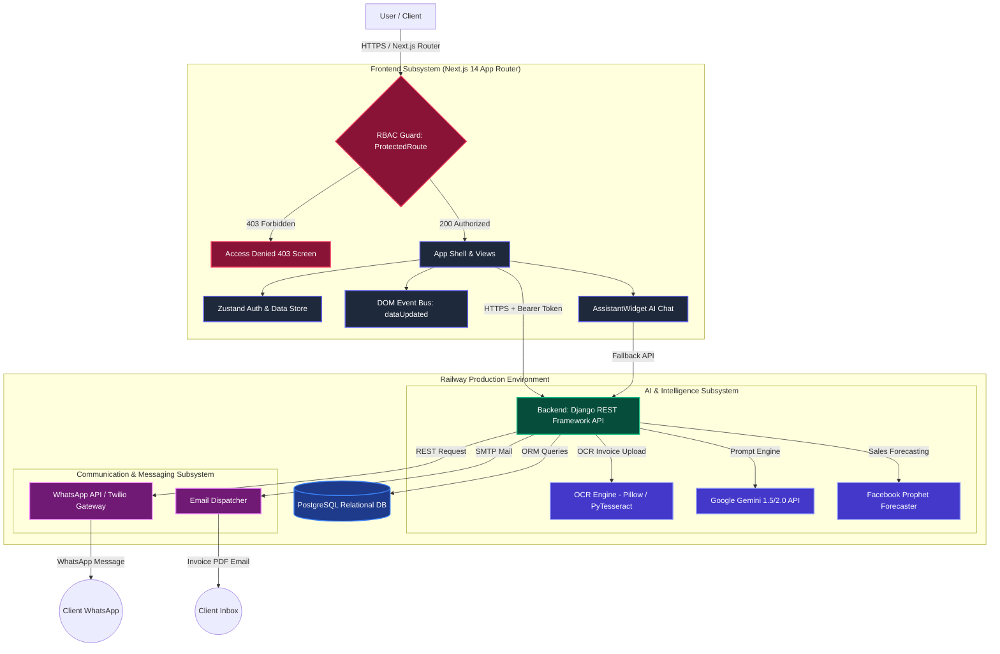
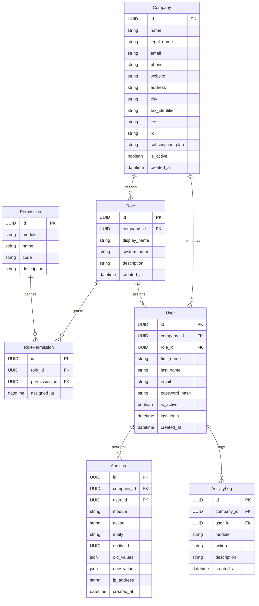
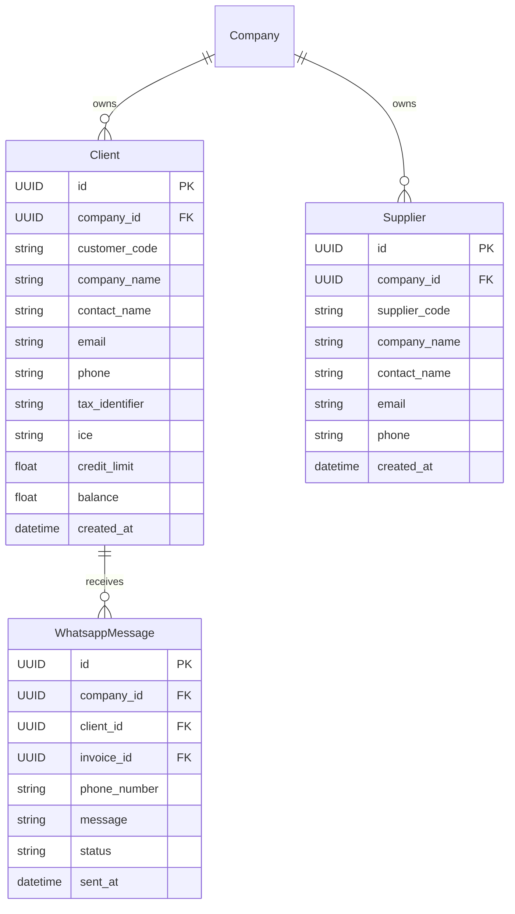
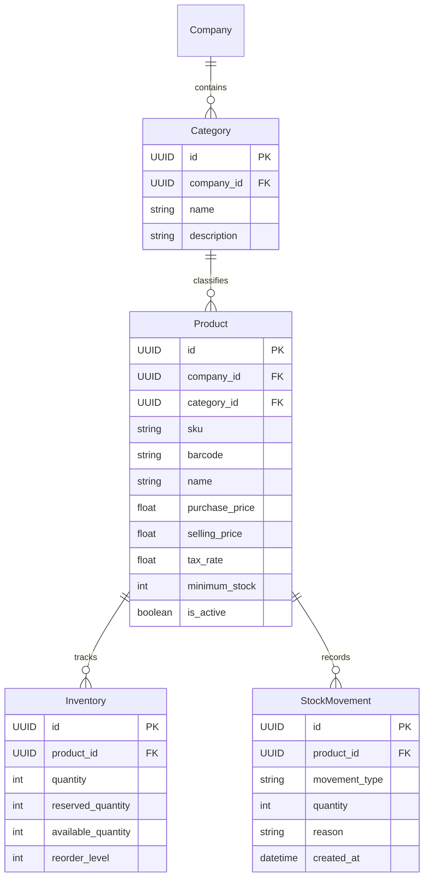
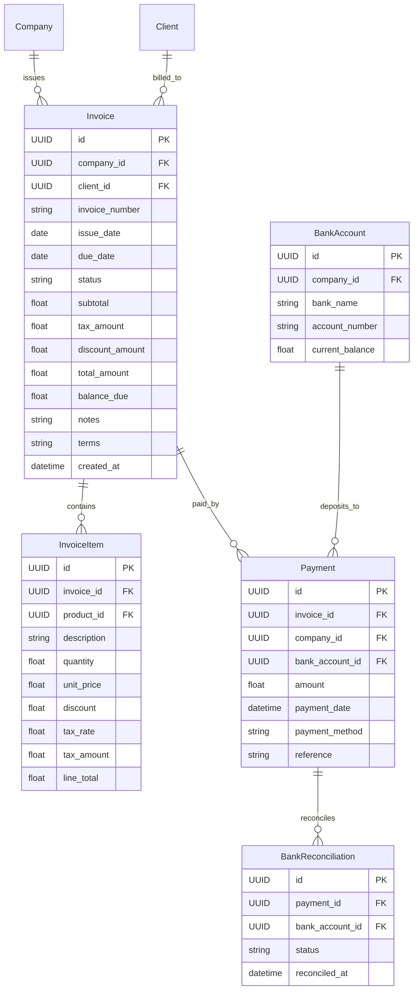
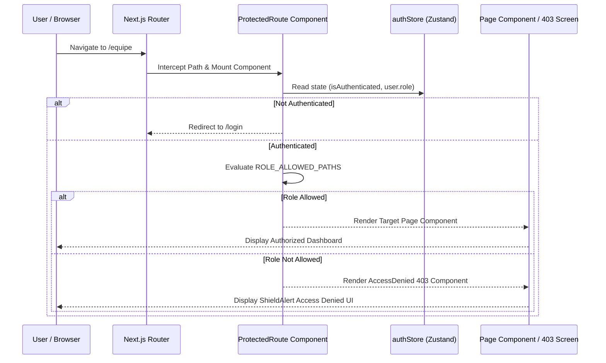
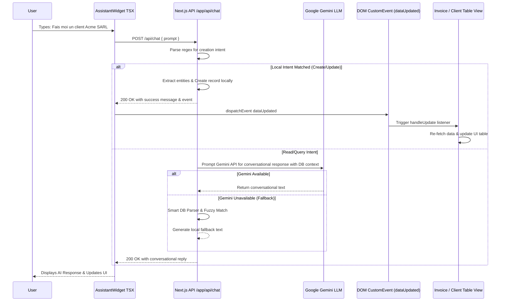
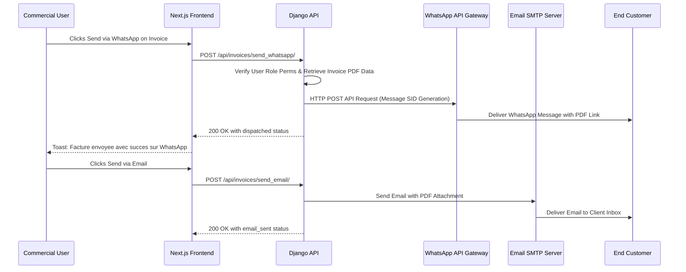
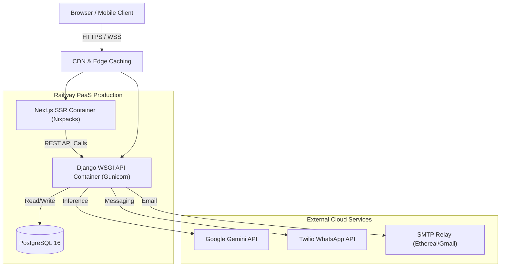

# Software Architecture & Detailed Design Document (SAD & SDD)

**Project:** Tadbir AI (Intelligent ERP, CRM, & Invoicing System)  
**Version:** 2.5.0  
**Date:** September 2026  

---

## 1. Executive Summary

**Tadbir AI** is an enterprise-grade Resource Planning (ERP) and Customer Relationship Management (CRM) platform engineered specifically for modern Moroccan businesses and enterprises. The platform seamlessly unifies core operational modules—Accounting, Inventory Management, Human Resources & Payroll, Point of Sale (POS), and CRM—with cutting-edge Artificial Intelligence and Multi-Channel Communication.

Key advancements in Version 2.5.0 include a robust, fine-grained **Role-Based Access Control (RBAC)** security architecture, multi-tenant company data isolation, interactive team permission management, automated dual-channel document dispatches (WhatsApp API & Email), dynamic client-side event bus synchronization (`dataUpdated`), and an AI intent-parsing engine with automatic fallback to Gemini LLM models.

---

## 2. Software Architecture Design (SAD)

### 2.1 Architectural Patterns

The system is constructed on a high-performance **Decoupled Client-Server Architecture** utilizing RESTful API contracts over HTTPS:

1. **Frontend Subsystem (Presentation Layer):** A Server-Side Rendered (SSR) & Client-Side Hydrated Component Architecture built on **Next.js 14** (React) with the App Router paradigm. Uses **Zustand** for lightweight reactive global state management and **TailwindCSS** for responsive Bento-Grid design aesthetics.
2. **Security & Protection Layer:** A declarative frontend route-guard framework (`ProtectedRoute.tsx`) combined with backend token verification and permission guards. Enforces strict Role-Based Access Control (RBAC) across client routes and backend API endpoints.
3. **Backend Subsystem (Application Layer):** Follows the Model-View-Template (MVT) pattern via **Django 6.x** and **Django REST Framework (DRF)**. Manages business logic, database transactions, multi-tenancy, and RESTful routing via `rest_framework.routers.DefaultRouter`.
4. **AI & ML Subsystem (Intelligence Layer):** Operates a hybrid execution pattern: local fast-path regex/fuzzy French business intent matcher combined with asynchronous fallback calls to **Google Gemini LLM** API for complex natural language queries and OCR document extraction.
5. **Event-Driven UI Subsystem:** Utilizes a custom DOM event bus (`dataUpdated`) enabling asynchronous background tasks (such as AI chatbot entity creation or team permission updates) to trigger real-time table re-renders across open client views without page reloads.
6. **Persistence Layer:** Relational database storage powered by **PostgreSQL** in production environments (managed via Django ORM) with **SQLite3** support for isolated local development and automated CI testing.

---

### 2.2 High-Level Architecture Diagram

---

### 2.3 Containerization & Deployment Architecture

The infrastructure is orchestrated for cloud deployment on **Railway** utilizing a monorepo setup:

- **Frontend Subsystem (Nixpacks Engine):** Deployed from repository root. Railway's Nixpacks builder detects `package.json`, installs Node.js dependencies, and executes `next build` producing a standalone SSR server.
- **Backend Subsystem (Docker Container):** Located under `fawatir_backend/Dockerfile`. Uses a light Python 3.12 Alpine container with Gunicorn WSGI server handling high-concurrency REST endpoints.
- **Root Health Check & Documentation Route:** The root backend path (`/`) dynamically redirects to Swagger OpenAPI documentation (`/api/docs/`) or returns JSON health metrics (`/health_check/`) to keep Docker and Railway health monitors active.
- **Continuous Integration (CI/CD):** GitHub Actions workflows execute automated backend test suites (`pytest` / `django.test`) and validate TypeScript compilation prior to production deployment.

---

### 2.4 Architectural Security Subsystem & Role-Based Access Control (RBAC)

Version 2.5.0 introduces a comprehensive multi-layered security architecture designed to enforce principle of least privilege, multi-tenant isolation, and route protection.

```mermaid
graph LR
    subgraph "Authentication & State Hydration"
        Login["User Login / Token Exchange"] --> LocalStorage["localStorage: access_token, user"]
        LocalStorage --> StoreHydrate["authStore.hydrate"]
        StoreHydrate --> UserState["Zustand: user, role"]
    end

    subgraph "Frontend Security Guard"
        UserState --> RouteCheck{"ProtectedRoute Evaluation"}
        RouteCheck -->|Path in PUBLIC_PATHS| AllowPublic["Render Component"]
        RouteCheck -->|Role Allowed in ROLE_ALLOWED_PATHS| AllowProtected["Render Component"]
        RouteCheck -->|Role Unauthorized| Render403["Render ShieldAlert 403 Screen"]
    end

    subgraph "Backend API Security Guard"
        AllowProtected -->|HTTP Header: Bearer Token| DRFAuth["DRF Authentication Middleware"]
        DRFAuth --> DRFPerm["IsAuthenticated & Role Class Permissions"]
        DRFPerm --> TenantFilter["Filter QuerySet by User.company_id"]
        TenantFilter --> DBExecute["Execute Database Action & Audit Log"]
    end

    classDef auth fill:#1E293B,stroke:#38BDF8,stroke-width:2px,color:#fff;
    classDef guard fill:#4C1D95,stroke:#A78BFA,stroke-width:2px,color:#fff;
    classDef api fill:#064E3B,stroke:#34D399,stroke-width:2px,color:#fff;
    
    class Login,LocalStorage,StoreHydrate,UserState auth;
    class RouteCheck,AllowPublic,AllowProtected,Render403 guard;
    class DRFAuth,DRFPerm,TenantFilter,DBExecute api;
```

#### 2.4.1 Granular Role & Access Control Matrix

The system categorizes enterprise users into 6 distinct system roles with defined route allowances and operational permissions:

| System Role | Code Keys | Allowed Route Prefixes | Key Capabilities & Functional Boundaries |
| :--- | :--- | :--- | :--- |
| **Administrateur** | `Administrateur`, `Admin` | `*` (All System Routes) `/equipe`, `/parametres`, `/entreprise`, `/abonnement`, `/employes`, `/bulletins-de-paie`, `/rapprochement`, `/rapports`, `/depenses`, `/bons-de-commande`, `/pos`, `/whatsapp`, `/devis`, `/avoirs`, `/modele-facture`, `/profil` | Full operational and administrative domain control. Invites/manages team members, modifies company settings, changes subscriptions, overrides financial ledgers, and views system audit logs. |
| **Comptable** | `Comptable`, `Accountant` | `/bulletins-de-paie`, `/rapprochement`, `/rapports`, `/depenses`, `/bons-de-commande`, `/devis`, `/avoirs`, `/modele-facture`, `/profil` | Full financial & accounting management. Access to payroll ledgers, bank reconciliation, expense validation, balance sheets, tax calculations, invoice templates, and PDF generation. |
| **Commercial** | `Commercial`, `Sales` | `/pos`, `/whatsapp`, `/devis`, `/profil`, `/factures`, `/clients` | Sales, CRM, and customer dispatch operations. Creates and sends quotations/invoices, manages client directories, dispatches WhatsApp/Email communications, executes POS sales. |
| **Ressources Humaines** | `Ressources Humaines`, `HR` | `/employes`, `/bulletins-de-paie`, `/profil` | Human Resources management. Manages employee profiles, department allocations, contracts, attendance tracking, and payslip (`bulletin de paie`) calculations. |
| **Caissier** | `Caissier`, `Cashier` | `/pos`, `/profil` | Direct in-store point of sale terminal operations. Opens/closes POS sessions, scans product barcodes, processes immediate sales cash/card transactions, prints customer receipts. |
| **Lecteur** | `Lecteur`, `Employee` | `/profil`, `/depenses`, `/bons-de-commande`, `/devis`, `/avoirs` | Basic employee / read-only access. Views personal user profile, submits expense claims (`depenses`), views assigned quotes/invoices without edit permissions. |

---

## 3. Software Detailed Design (SDD)

### 3.1 Frontend Subsystem Architecture (Presentation Layer)

The frontend is structured around modular, reusable TSX components adhering to modern React practices.

- **Client Route Protection (`ProtectedRoute.tsx`):** Wraps all application routes. Intercepts navigation attempts, validates `user.role` against `ROLE_ALLOWED_PATHS`, and outputs a polished 403 Forbidden UI displaying the user's current role and target path when permission is denied.
- **Authentication Store (`lib/store/authStore.ts`):** Lightweight Zustand store providing central user state (`user`, `accessToken`, `refreshToken`, `isAuthenticated`), `login()`, `logout()`, `setRole()`, and `hydrate()` methods. Automatically synchronizes session data with `localStorage`.
- **API Fetch Interceptor (`lib/api.ts`):** Centralized HTTP utility that automatically injects `Authorization: Bearer <access_token>` into outbound requests sent to Django backend services.
- **Team Management Interface (`app/equipe/page.tsx`):** Admin dashboard component allowing real-time role delegation, team invitation creation (`handleInvite`), member account deactivation, and instant trigger of `dataUpdated` events across open tabs.
- **AI Assistant Widget (`components/AssistantWidget.tsx`):** Interactive chatbot drawer integrated into the main layout. Features natural language intent recognition, rich markdown rendering (`react-markdown`), dark mode contrast, and auto-dispatch of data synchronization events.

---

### 3.2 Backend Router & API Endpoint Specification

The backend API exposes endpoints structured under `rest_framework.routers.DefaultRouter`:

| Subsystem Module | API Route Prefix | DRF ViewSet / Views | Key Operations & Security Scope |
| :--- | :--- | :--- | :--- |
| **Foundation & Auth** | `/api/users/` `/api/roles/` `/api/permissions/` `/api/company-settings/` `/api/audit-logs/` | `UserViewSet` `RoleViewSet` `PermissionViewSet` `CompanySettingViewSet` `AuditLogViewSet` | Authentication, password management, role-permission assignments, company profile configurations, and compliance audit trail logging. |
| **CRM & Messaging** | `/api/clients/` `/api/suppliers/` `/api/whatsapp-messages/` `/api/clients/clear/` | `ClientViewSet` `SupplierViewSet` `WhatsappMessageViewSet` `Custom Action /clear/` | Customer & supplier management. Custom action `/send_whatsapp/` dispatches WhatsApp messages. Custom action `/clear/` purges mock records. |
| **Inventory** | `/api/categories/` `/api/products/` `/api/inventory/` `/api/stock-movements/` | `CategoryViewSet` `ProductViewSet` `InventoryViewSet` `StockMovementViewSet` | Cataloging, SKU generation, stock level monitoring, reorder alerts, and automated stock movement tracking. |
| **Accounting** | `/api/invoices/` `/api/payments/` `/api/bank-accounts/` `/api/bank-reconciliations/` | `InvoiceViewSet` `PaymentViewSet` `BankAccountViewSet` `BankReconciliationViewSet` | Invoice creation, tax calculations, payment registration, bank transaction matching (`reconciliation`), and custom `/send_email/` PDF dispatch. |
| **Quotations & Purchases**| `/api/quotations/` `/api/purchase-orders/` | `QuotationViewSet` `PurchaseOrderViewSet` | Pro-forma invoice / devis creation, status transitions (Draft -> Sent -> Approved -> Invoiced), supplier purchase orders. |
| **Point of Sale** | `/api/pos-sessions/` `/api/pos-sales/` | `PosSessionViewSet` `PosSaleViewSet` | Till session management, opening/closing balances, instant barcode sales, receipt generation. |
| **Human Resources** | `/api/employees/` `/api/departments/` `/api/payrolls/` | `EmployeeViewSet` `DepartmentViewSet` `PayrollViewSet` | Staff management, department trees, salary structures, payslip calculations (`bulletin de paie`). |
| **AI Subsystem** | `/api/ai-conversations/` `/api/ocr-documents/` `/api/ai-tasks/` | `AiConversationViewSet` `OcrDocumentViewSet` `AiTaskViewSet` | Conversational history persistence, OCR document text extraction, background AI task queue. |

---

### 3.3 Database Entity-Relationship (ER) Schema

#### 3.3.1 FOUNDATION & SECURITY MODULE

#### 3.3.2 CRM & MESSAGING MODULE

#### 3.3.3 INVENTORY & CATALOG MODULE

#### 3.3.4 ACCOUNTING & FINANCIAL LEDGER MODULE

---

### 3.4 Feature Deep-Dive: RBAC Route Access Verification Flow

The sequence diagram below illustrates the operational flow when a logged-in user navigates to a protected route (e.g. `/equipe` or `/bulletins-de-paie`):

---

### 3.5 Feature Deep-Dive: AI Chatbot Dual-Engine & Dynamic Data Sync

---

### 3.6 Feature Deep-Dive: WhatsApp & Email Document Dispatch Flow

---

## 4. Technology Stack & Dependencies

### 4.1 Frontend Technologies
- **Framework:** Next.js 14 (App Router), React 18, TypeScript 5
- **Styling & UI:** TailwindCSS, Lucide Icons (`lucide-react`), Bento Grid Utilities
- **State & Data Management:** Zustand 4 (`authStore.ts`), Custom DOM Event Bus (`dataUpdated`)
- **Document Rendering:** `react-markdown`, `remark-gfm` (AI response formatting)
- **Data Export Utilities:** `xlsx` (Excel export), `jspdf` / html2canvas (Print views)

### 4.2 Backend & Infrastructure Technologies
- **Core Framework:** Python 3.12, Django 6.x, Django REST Framework (DRF)
- **Database Systems:** PostgreSQL (Production on Railway), SQLite3 (Local Dev & Testing)
- **AI / Machine Learning Services:** `google-generativeai` (Gemini LLM), PyTesseract / Pillow (OCR), Facebook Prophet (Time-Series Sales Forecasting)
- **Third-Party Messaging APIs:** Twilio SDK (WhatsApp Business API), Django Core Mail (SMTP Email Dispatch)
- **Deployment & Containers:** Railway PaaS, Nixpacks Standalone Frontend Engine, Docker & Gunicorn WSGI Server

---

## 5. Security, Multi-Tenancy & Integrity

1. **Role-Based Access Control (RBAC):** Strict enforcement of authorization limits at both presentation tier (`ProtectedRoute.tsx`) and application tier (DRF ViewSet permissions).
2. **Multi-Tenant Company Segregation:** All core database entities maintain a non-nullable foreign key `company_id`. ORM querysets are automatically scoped to the user's active company, preventing cross-tenant data leakage.
3. **Audit & Activity Tracking:** Key database mutations (user invitations, role modifications, invoice cancellations, data purges) automatically record an `AuditLog` entry storing actor ID, IP address, timestamp, and pre/post JSON deltas.
4. **Token Security & Storage:** Authentication tokens (`access_token`, `refresh_token`) are handled securely with Bearer header injection via `lib/api.ts`.
5. **CORS & Environment Injection:** API calls are restricted via `django-cors-headers` to verified origin domains. Production secrets (`SECRET_KEY`, `GEMINI_API_KEY`, `TWILIO_AUTH_TOKEN`) are injected strictly through Railway runtime variables.

---

## 6. Frontend State Management & React Architecture

Tadbir AI utilizes a robust, lightweight state management architecture built on **Zustand** combined with React Context and Custom Events. This ensures real-time reactivity without the boilerplate of Redux.

### 6.1 State Management Flow

- **Zustand (`authStore.ts`)**: Manages the global authentication state, storing the JWT tokens, user profile data (email, name, role), and the active session status. It hydrates state from `localStorage` on initial load.
- **Custom DOM Event Bus (`dataUpdated`)**: Used for sibling-to-sibling communication without prop drilling. For example, when the `AssistantWidget` creates an entity via API, it dispatches the `dataUpdated` custom event. Any mounted Table views listening to this event automatically refetch their data to provide a seamless real-time experience.

---

## 7. Deployment & DevOps Architecture

The system is deployed using a decoupled, high-availability architecture via Platform-as-a-Service (PaaS).

- **Frontend Container**: Packaged via Nixpacks, serving statically optimized pages alongside SSR routes.
- **Backend Container**: Dockerized Django REST Framework running behind Gunicorn workers.
- **Database**: Managed PostgreSQL instance with automated daily backups.

---

## 8. Non-Functional Requirements (NFRs)

To ensure enterprise-grade reliability, Tadbir AI strictly adheres to the following Non-Functional Requirements:

### 8.1 Performance & Scalability
- **Response Time**: 95% of standard API endpoints must respond in under 200ms. AI Fallback endpoints (Gemini) must stream responses within 1.5 seconds.
- **Horizontal Scalability**: The decoupled architecture allows spinning up additional Next.js or Django containers behind a load balancer independently based on traffic spikes.

### 8.2 Security & Integrity
- **Authentication**: Stateless JWT mechanism (Access/Refresh tokens) with short lifespans.
- **Data Isolation**: Strict Row-Level Security enforcement via the `company_id` foreign key ensuring multi-tenant isolation.
- **Encryption**: Passwords hashed using Argon2/PBKDF2. Data transmitted strictly over TLS 1.3 (HTTPS).

### 8.3 Maintainability & Code Quality
- **Strong Typing**: 100% TypeScript coverage on the frontend to eliminate runtime errors.
- **Modular Django Apps**: Backend logic separated into distinct domain-driven apps (`api`, `ai`, `core`).

---
